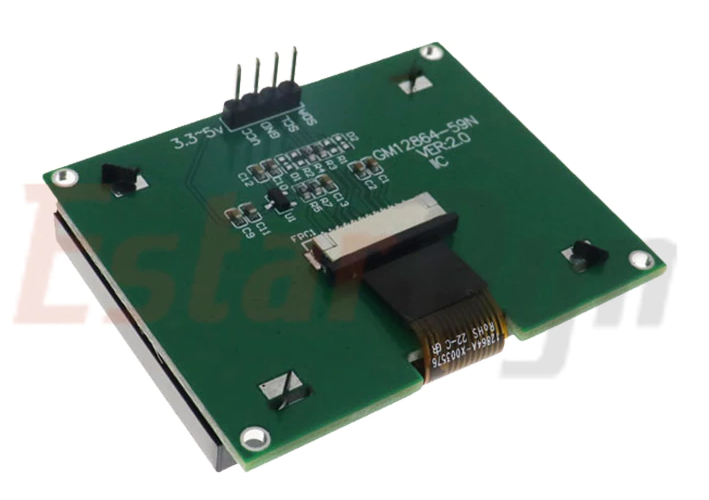

# ST7567S_128X64_I2C
I2C communication protocol, used to drive the ST7567S 128*64 pixels LCD. 
Base on Arduino UNO

2022-05-28
  - correct bug in "ClearPixel"
  - import DrawLine, draw_circle_section and draw_circle from U8G2 (https://github.com/olikraus/u8g2)

original code from  https://github.com/mworkfun/ST7567A_128X32DOT_LCD
